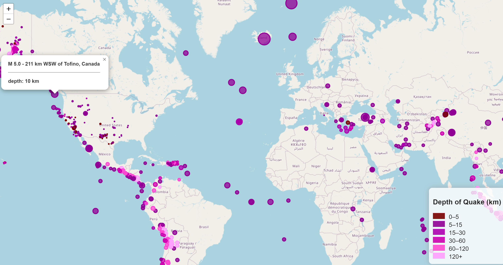

# leaflet-challenge

Javascript Interactive Mapping
This challenge involves mapping earthquake data from the USGS.  The Leaflet library was used to plot the geojson data obtained from https://earthquake.usgs.gov/earthquakes/feed/v1.0/geojson.php

Circles on the map indicate recorded earthquakes from a particular time period, which can be updated.  The color of the circles represents the earthquake depth, and the size of the circles represents the magnitude of the earthquake.  Clicking on a circle profices information on location, depth, and magnitude.  

This app is deployed to GitHub Pages at https://bluffermk.github.io/leaflet-challenge/
